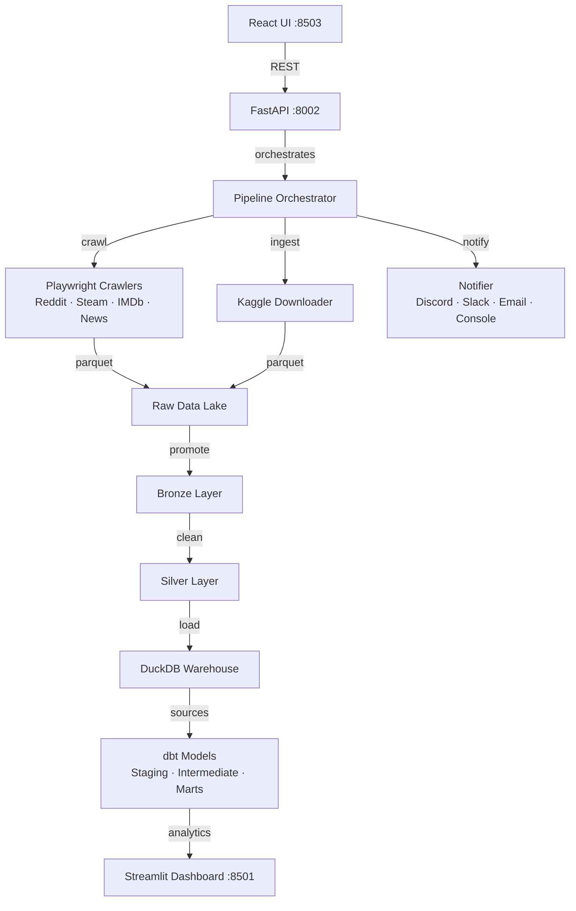

# DataForge ELT

> Data engineering pipeline, end-to-end ELT: Playwright web crawling, multi-layer data lake, DuckDB warehouse, dbt transformations, FastAPI backend, Streamlit analytics dashboard, and React control UI.

---

## Architecture



---

## Tech Stack

| Layer | Technology | Purpose |
|---|---|---|
| Crawling | Playwright + Python 3.13 | Async browser automation |
| Retry | Tenacity | Exponential backoff |
| Rate limiting | Token bucket (custom) | Polite crawling |
| Data processing | Pandas + PyArrow | Transform + Parquet |
| Data validation | Pandera | Schema + type enforcement |
| Config | Pydantic Settings | Typed env-var config |
| Logging | Loguru | Structured, rotating logs |
| Warehouse | DuckDB | Embedded OLAP |
| Transformations | dbt-duckdb | SQL ELT models |
| API | FastAPI + Uvicorn | Async REST backend |
| Dashboard | Streamlit | Live analytics UI |
| Frontend | React 18 + Vite + Tailwind | Pipeline control UI |
| Notifications | Discord / Slack / Email | Pipeline events |
| Remote storage | AWS S3 | Parquet backup |
| Metadata store | Supabase Postgres | Run history |
| Document store | MongoDB Atlas | Raw crawl results |
| Container | Docker Compose | One-command deployment |
| CI/CD | GitHub Actions | Test → build → deploy |

---

## Features

### Crawler Engine
- Abstract `BaseCrawler` with full lifecycle: `start → fetch → parse → validate → clean → save → finish`
- **Token-bucket rate limiter** — configurable RPS per crawler
- **robots.txt compliance** — per-domain cache, fail-open
- **Exponential backoff retry** via Tenacity
- **Screenshot on failure** — saved to `logs/screenshots/`
- **Pagination strategies** — page-number and cursor-based
- Cookie and proxy support (proxy ready, off by default)
- 4 production crawler profiles: **Reddit**, **Steam**, **IMDb**, **News**

### Data Lake
- 4-layer medallion architecture: `raw → bronze → silver → gold`
- Parquet format with date-partitioned versioning (`YYYY/MM/DD/`)
- `DataLakeManager` with `promote()` for layer transitions
- Metadata tracking per entry

### DuckDB Warehouse
- Auto schema inference from DataFrames
- Three load modes: `append`, `overwrite`, `incremental`
- Parquet view registration for dbt sources
- `DuckDBWarehouse` with full CRUD + table metadata

### dbt Project
Showcases every major dbt feature:
- **Sources** — 4 raw sources (Reddit, Steam, IMDb, News)
- **Staging** — cleaned views, HTML stripping, normalization
- **Intermediate** — ephemeral enrichment + unified content model
- **Marts** — `fct_content`, `fct_engagement_metrics`, `dim_sources`
- **Incremental models** — `is_incremental()` time-window processing
- **Snapshots** — SCD Type 2 for Steam prices and Reddit scores
- **Seeds** — `content_categories.csv`, `source_metadata.csv`
- **Macros** — `normalize_text`, `clean_html`, `safe_cast`, `trim_strings`, `calculate_growth`, `generate_surrogate_key`
- **Custom tests** — `positive_score`, `not_future_date`
- **Singular tests** — referential integrity, uniqueness
- **Analyses** — `content_distribution`, `engagement_trends`
- **Full schema.yml docs** with column-level descriptions

### FastAPI Backend
- 10 endpoints across 7 routers
- Full dependency injection via `Depends()`
- OpenAPI docs at `/docs`
- Global exception handler mapping `DataForgeError` → HTTP status codes
- Async endpoints, Pydantic response models

### Streamlit Dashboard (5 pages)
- **Overview** — KPI cards, ingestion timeline, source distribution
- **Pipeline** — run history, status badges, error list
- **Crawler** — per-source status, error rates, screenshot gallery
- **Warehouse** — table browser, schema viewer, data preview
- **dbt** — test results, lineage diagram, run buttons
- **Logs** — live log stream with level filter and auto-refresh

### Notifications
Multi-channel fan-out with `NotifierFactory`:
- Console (always on)
- Discord webhook
- Slack webhook
- Email (SMTP/TLS)

---

## Quick Start

```bash
git clone <repo-url>
cd DataForge-ELT

cp .env.example .env      # fill in credentials
./scripts/setup.sh        # install deps + Playwright browsers

# Start API
uv run python main.py serve

# Start dashboard (separate terminal)
uv run python main.py dashboard

# Or: one-command with Docker
docker compose -f docker/docker-compose.yml up --build
```

URLs:
- FastAPI: http://localhost:8002
- API Docs: http://localhost:8002/docs
- Streamlit: http://localhost:8501
- React UI: http://localhost:8503

---

## Project Structure

```
DataForge-ELT/
├── app/                    FastAPI application
│   ├── api/routers/        10 route handlers
│   ├── api/schemas/        Pydantic request/response models
│   ├── services/           Business logic layer
│   ├── dependencies.py     FastAPI DI wiring
│   ├── main.py             App factory
│   └── ui/                 React 18 + Vite + Tailwind frontend
├── config/
│   └── settings.py         Pydantic Settings (all config from .env)
├── crawlers/
│   ├── base/               BaseCrawler, BrowserManager, RateLimiter, RobotsChecker
│   ├── reddit/             RedditCrawler
│   ├── steam/              SteamCrawler
│   ├── imdb/               ImdbCrawler
│   └── news/               NewsCrawler
├── datalake/               DataLakeManager + versioning
├── dbt/                    Full dbt project (duckdb adapter)
│   ├── models/             staging / intermediate / marts / incremental
│   ├── snapshots/          SCD Type 2
│   ├── macros/             6 reusable macros
│   ├── seeds/              Reference data CSVs
│   └── tests/              Generic + singular custom tests
├── dashboard/              Streamlit app (5 pages)
├── docker/                 Dockerfiles + docker-compose (dev + prod)
├── ingestion/
│   ├── kaggle/             KaggleDownloader + CSV→Parquet converter
│   ├── crawler/            CrawlerIngestor
│   └── loaders/            ParquetLoader + DuckDBLoader
├── orchestration/          PipelineOrchestrator + APScheduler
├── scripts/                deploy.sh, setup.sh, prod-deploy.sh
├── shared/                 logger, retry, exceptions, notifier, metrics, utils
├── tests/                  161 tests across all modules
├── warehouse/duckdb/       DuckDBWarehouse + connection + schema inference
├── .env.example            Template (fill in + copy to .env)
├── .github/workflows/      CI (ci.yml) + Deploy (deploy.yml)
└── main.py                 Typer CLI entrypoint
```

---

## CLI Commands

```bash
uv run python main.py serve                          # Start FastAPI on :8002
uv run python main.py dashboard                      # Start Streamlit on :8501
uv run python main.py crawl --source reddit --urls "https://reddit.com/r/python"
uv run python main.py pipeline --name full
uv run python main.py dbt build
uv run python main.py dbt test
uv run python main.py dbt docs
```

---

## Running dbt

```bash
cd dbt
dbt deps               # install dbt_utils
dbt seed               # load content_categories + source_metadata
dbt build              # run + test all models
dbt test               # test only
dbt docs generate      # generate docs site
dbt docs serve         # open docs at http://localhost:8080
```

---

## API Reference

| Method | Path | Description |
|---|---|---|
| GET | `/health` | Health check |
| POST | `/api/v1/crawl` | Trigger a crawler |
| POST | `/api/v1/kaggle/download` | Download Kaggle dataset |
| POST | `/api/v1/pipeline/run` | Run a named pipeline |
| GET | `/api/v1/pipeline/status/{run_id}` | Check pipeline status |
| GET | `/api/v1/pipeline/runs` | List all runs |
| POST | `/api/v1/dbt/build` | Run dbt build |
| POST | `/api/v1/dbt/test` | Run dbt test |
| POST | `/api/v1/dbt/docs` | Generate dbt docs |
| GET | `/api/v1/datasets` | List available datasets |
| GET | `/api/v1/logs` | Stream pipeline logs |

Full interactive docs: http://localhost:8002/docs

---

## Environment Variables

| Variable | Description | Default |
|---|---|---|
| `SECRET_KEY` | App secret key | *(required)* |
| `DATA_LAKE` | Data lake root path | `./datalake` |
| `DUCKDB_PATH` | DuckDB file path | `./warehouse/data.duckdb` |
| `LOG_LEVEL` | Logging level | `INFO` |
| `HEADLESS` | Playwright headless mode | `true` |
| `CRAWLER_TIMEOUT` | Browser timeout (seconds) | `30` |
| `RATE_LIMIT_RPS` | Requests per second | `1.0` |
| `MAX_RETRIES` | Retry attempts | `3` |
| `KAGGLE_USERNAME` | Kaggle API username | — |
| `KAGGLE_KEY` | Kaggle API key | — |
| `AWS_ACCESS_KEY_ID` | AWS access key | — |
| `AWS_S3_BUCKET` | S3 bucket name | `dataforge-elt-storage` |
| `SUPABASE_URL` | Supabase project URL | — |
| `MONGODB_URL` | MongoDB Atlas connection | — |
| `MONGODB_DB` | MongoDB database name | `dataforge_elt` |
| `DISCORD_WEBHOOK` | Discord notification URL | — |
| `GROQ_API_KEY` | Groq LLM API key | — |

See `.env.example` for the full list.

---

## Development

```bash
uv run pytest tests/ -v --cov        # run all 161 tests
uv run ruff check .                  # lint
uv run black .                       # format
```

---

## Docker Deployment (VPS)

```bash
# First deploy — push to main triggers GitHub Actions automatically.
# Manual deploy to VPS:
./scripts/prod-deploy.sh

# Local full stack:
docker compose -f docker/docker-compose.yml up --build
```

Production VPS (89.167.74.123):
- FastAPI API: **:8002**
- Streamlit Dashboard: **:8501**
- React UI: **:8503**

Data is persisted under `/mnt/portfolio-data/dataforge/` on the Hetzner volume.

---

## Git Deployment

Never push directly. Use the deploy script:

```bash
./scripts/deploy.sh "feat: add new crawler profile"
```

GitHub Actions handles CI on every push and deploys to production on `main`.

---

## License

MIT © raybags-dev
